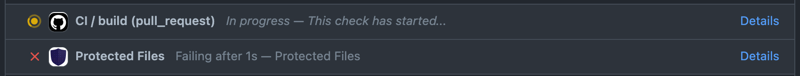
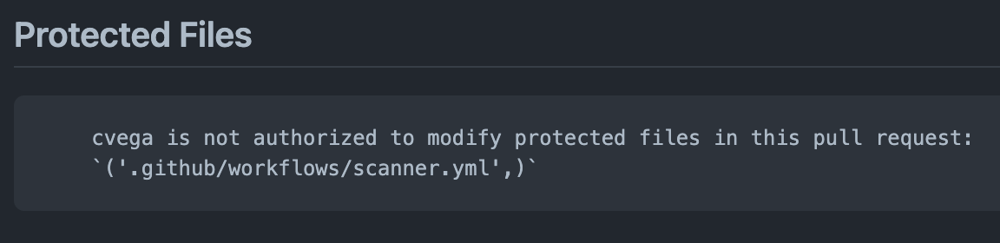
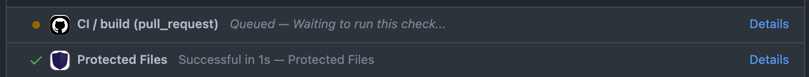
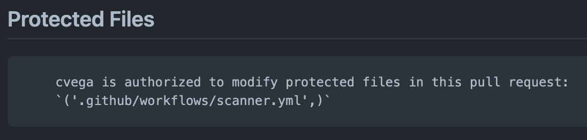

# Protected Files / PR Bot

This bot is useful for when you need to protect specific files across many repos from being modified by organization users. This is mostly useful for preventing the modification of actions/workflows as part of a pull request. This bot is typically deployed by GitHub enterprise and organizations administrators that want to include specific workflows across their organization while ensuring end users aren't modifying or deleting them.

Please note, This bot needs to be used in conjunction with branch protections, and will supersede `CODEOWNERS` settings within the repo. If your default branch does not require a pull request, this bot will not be helpful.

You may also want to considering using the safer `pull_request_target` trigger versus the `pull_request` trigger with actions workflows. This ensures that the default branch workflows are used and not the branch workflows which may or could be modified.

## How it works

When a PR is created a webhook is sent to the bot. The bot creates a `check_run` for the PR and inspects the changes in the PR. If any of the files in the `files` list are modified by a user that is not listed as an `owner`, it will automatically fail the pr by updating the `check_run` with the `status` of `failure`.

The bot is `Flask` based and runs on port `5000` by default. A Dockerfile has been included for ease of use. Otherwise you'll need to provision the bot yourself.

## In practice

### Preventing the modification of files




### Allowing modification of files when a user owns the file




## Setup Requirements

You'll need a host to provision this application. A Dockerfile has been included for ease of use. Otherwise you'll need to provision the bot yourself.

- **Organization webhook**
  - URL (where this bot runs)
  - Let me select individual events.
    - Pull requests

<br>

- **Branch Protections Enabled**
  - Require a pull request before merging
  - Require status checks to pass before merging
    - Require branches to be up to date before merging
  - Include administrators

If you're looking for an actions based bot that will ensure a branch protection policy is deployed to your organization please see my [Protected Branch Policy](https://github.com/cvega/protected-branch-policy) project

<br>

- **GitHub App**
  - Create a GitHub App
    - scopes
      - check_run
        - read/write
    - generate pem file
    - install app to organization
    - note the `app_id` and `installation_id`

  
## Configuration

| setting | usage |
|---:|:---|
| pem | path to pem file |
| url | GitHub URL (.com or GHES) |
| app_id | GitHub App app_id |
| installation_id | GitHub App installation_id |
| owner | list of users that have access to modify the protected files |
| files | list of protected files |

### config.yml example (required)

```yaml
pem: /path/to/secure.pem
url: https://api.github.com
app_id: 000001
installation_id: 00000001
owners:
  - cvega
  - octocat
files:
  - .github/workflows/dependency-scanner.yml
  - .github/workflows/code-scanner.yml
```